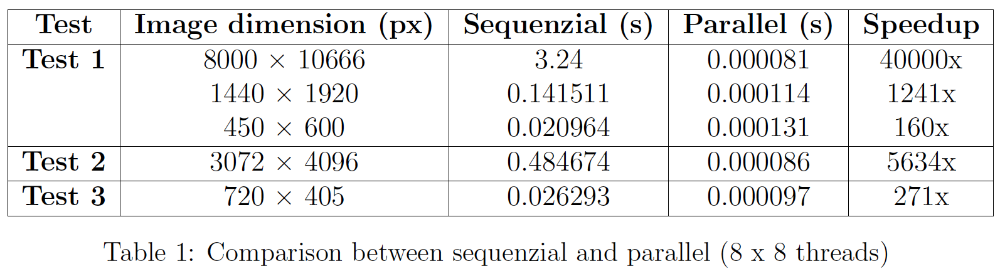

# GPU-Accelerated XOR Analysis: Efficient Image Differencing with CUDA 

## Overview
This project implements an image comparison tool using CUDA. The program performs pixel-wise XOR operations on two grayscale images after binarization, highlighting differences in the output.

## Features
- Performs binarization with a threshold.
- Computes pixel-wise XOR between the binarized images.
- Highlights differences in the original image.
- Saves the output images.

## Requirements
- CUDA-enabled GPU
- OpenCV (C++)
- NVIDIA CUDA Toolkit


## Usage
After you compile the code, run the program with:
```sh
./xor_comparison <image1> <image2> <threads_x> <threads_y>
```
Example:
```sh
./xor_comparison img1.jpg img2.jpg 16 16
```

## Output
- `outputs/XOR_parallel.jpg` (Binary XOR result)
- `outputs/evidence_result_parallel.jpg` (Highlighted differences)
<table>
  <tr>
    <td> </td>
    <td> </td>
    <td> </td>
    <td> </td>
  </tr>
</table>

## CUDA Kernels
### 1. `binarization_kernel`
Converts an image to binary using a threshold.

### 2. `xor_kernel`
Performs pixel-wise XOR between two binary images.

### 3. `mark_differences_kernel`
Highlights differences in the color image where XOR detected changes.

## Performances


## License
This project is licensed under the MIT License.

## Author
_Luigi Galluccio, 2025_

